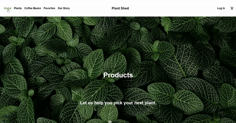

# PLANTSHED

A React Project built for Mod 1 covering React forms, react-router, and responsive CSS. This project was also expanded in Mod 3 to practice CI/CD using Docker and AWS. 

---

## Table of contents

- [Introduction](#introduction)
- [Competencies](#competencies)
- [Demo](#demo)
- [Technologies](#technologies)
- [Setup](#setup)
- [Features](#features)
- [Documentation](#documentation)
- [Contact](#contact)

---

## Introduction

PlantShed is one of the most popular plantstores in NYC. Not only do they sell a wide variety of houseplants and flowers, they have a local coffeeshop where customers can enjoy a fresh brew before shopping. PlantShed expands into the e-commerce space, where customers can view the inventory of plants, flowers, and coffeebeans and shop from home.

---

## Competencies 

#JF 1.5
- Knows how teams work effectively to produce software and how
to contribute appropriately

#JF 3.3
- Understands how to develop effective user interfaces

#JF 5.1
- Knows relevant and up-to-date software testing frameworks and
methodologies

#JF 6.2
- Understands how to follow company, team or client approaches to
continuous integration, version and source control

---

## Demo 




---

## Screenshots


---


## Technologies

- React - version 17.0.2
- Node.js - version 14.15.4
- Express.js - version 4.17.1
- Docker
- AWS Amazon S3

---

## Setup

To run this project, install it locally using npm:

```
cd plantshed
$ npm install
$ npm start
```
Then in a parallel terminal:
```
$ npm run start-dev
```

---

## Features

Users should be able to:
- sign up and sign in with the login form
- view plant and coffee inventory
- add and remove products from a shopping cart
- view more information about a product on a single view page
- favorite plants and coffee and view them in a favorites tab
- enter credit card and shipping information with the checkout form

Stretch Goals:

- Deploy the app on Heroku
- Add unit tests in Jest
- Add email notifications when items are left in shopping cart
- Add out of stock alert when items go out of stock
- Add Stripe payment

---

# Documentation

CI/CD Docker/AWS:  [Documentation](https://docs.google.com/document/d/1slL3HBzbyACMiKK8fbBxgoZxzzHoYpz4Q1bb61ARbpo/edit?usp=sharing)

 How to create branch and pull request:

- `git checkout -b newbranchname` (create a new branch for each issue)
- `git branch` (To confirm which branch you are on)
- `git add .` (To add all the changed files)
- `git status` (To check the status of the files)
- `git commit -m "message"`
- `git push -upstream newbranchname` (To push code)
- Create Pull request
- `git branch -D newbranchname` (To delete branch)
- `git branch -d newbranchname`
- `git merge main` (when in new branch)

---

## Contact

- [Judith Liem](https://github.com/jjliem)
- [Afreen S Mohammed](https://github.com/afreensafdar)
- [Ricardo Salcido](https://github.com/RSalcido2019)
